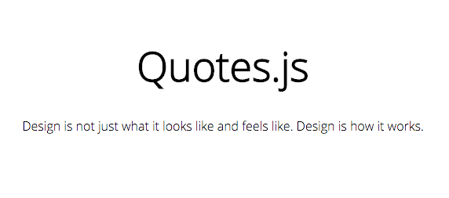

[](https://travis-ci.org/cauealves/quotes.js)

<p align="center">
  <a href="http://cauealves.github.io/quotes.js" target="_blank">
    
  </a>
</p>

## Install 

* Via `npm`
```shell
npm install quotesjs
```

* Via [Download](./dist/quotes.min.js?raw=true)
```html
<script type="text/javascript" src="js/quotes.min.js" async="async"></script>
```

## Usage

**This code is a simple way that you can configure a list of quotes inside a selector specified.**

```html
<section>
    <div class="quotes"></div>
</section>

<script type="text/javascript">
  window.onload = function(){
    var quotes = [
      'You never lose a dream. It just incubates as a hobby.',
      'Design is not just what it looks like and feels like. Design is how it works.',
      'Innovation distinguishes between a leader and a follower.',
      'Have enough courage to trust love one more time and always one more time.'
    ];
    
    Quotes.start(quotes, {
      selector: '.quotes',
      listType: 'unordered',
      listClass: 'list-quotes',
      sleep: 6
    });
  };
</script>
```
